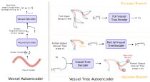
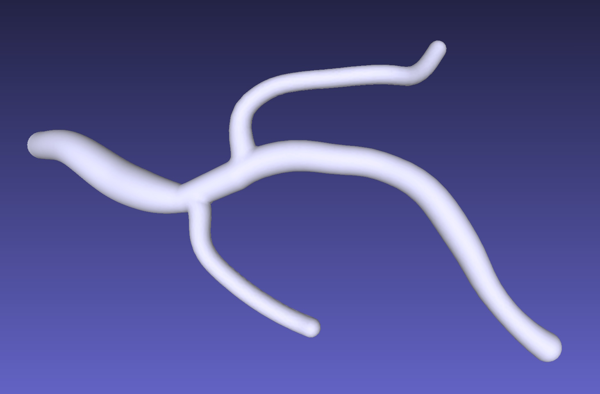
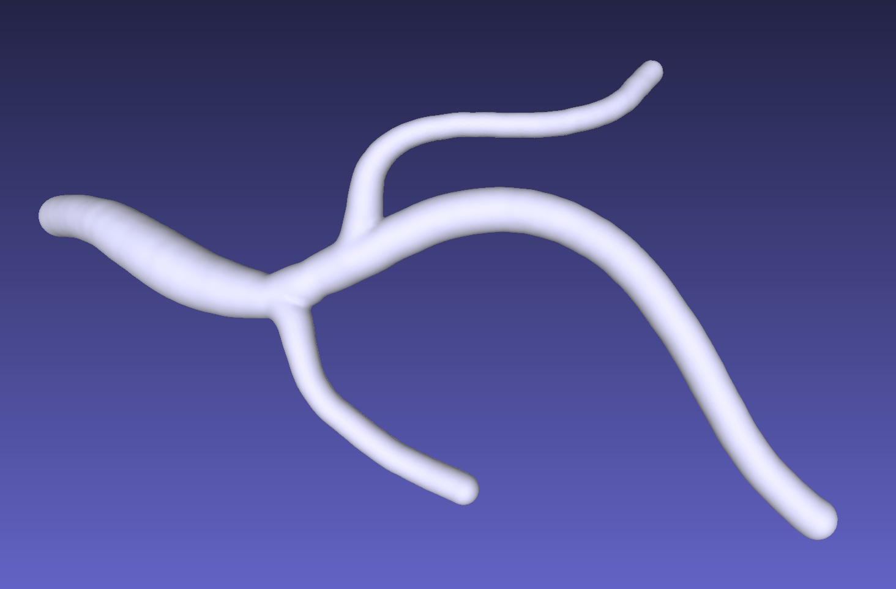
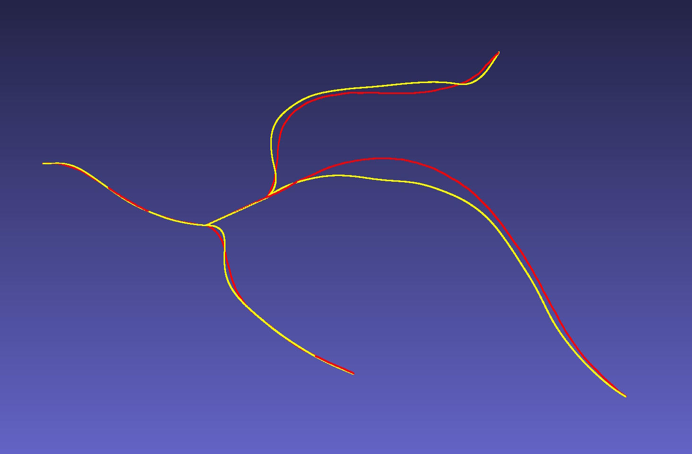

# VeTTA: Vessel Tree Transformer Autoencoder

[](https://arxiv.org/abs/2506.11163)
[](LICENSE)

> **VeTTA** (Vector **T**ree **A**utoencoder) is a two‑stage Transformer framework for learning compact, expressive representations of **3‑D vascular trees** such as coronary arteries. It encodes the *continuous* geometry of each vessel **segment** and the *discrete* **topology** of the full tree into a single latent vector, and it can recursively decode that vector back into a valid tree.

The code in this repository is the **official PyTorch implementation** accompanying [our paper](https://arxiv.org/abs/2506.11163) presented at **MIDL 2025**:

> **Vector Representations of Vessel Trees**
> James Batten, Michiel Schaap, Matthew Sinclair, Ying Bai, Ben Glocker
> Medical Imaging with Deep Learning (MIDL), 2025 — **Oral**

<p align="center">
  
</p>

Project page: https://jamesbatten.xyz/#project-vector-representations-of-vessel-trees

## 2D Latent Space Interpolations

<table>
  <tr>
    <td width="50%"></td>
    <td width="50%"></td>
  </tr>
  <tr>
    <td align="center"><b>Tree connectivity structure</b></td>
    <td align="center"><b>Segmentation mask</b></td>
  </tr>
</table>

These clips animate a smooth walk through VeTTA's latent space, decoding the
interpolated latent at each step while traversing a triangle between three 2D
synthetic trees. The left video shows the decoded tree connectivity structure
(the wireframe of vessels and their branching topology); the right shows the
corresponding rendered segmentation mask.

## Working With 3D Vessel Trees

VeTTA represents a 3D vessel tree by combining per-vessel geometry vectors with
the tree connectivity structure:

1. Train a vessel autoencoder on individual vessel segments with
   [VeCTA](https://github.com/JamesBatten/VeCTA).
2. Use the trained VeCTA model to optimise `enc_loss` and export each segment's
   `encoding`; these vectors become the geometry features attached to the tree.
3. Enable `skip_vessel` for very short vessels so they are not represented as
   unreliable standalone segments.

<table>
  <tr>
    <td width="33%"></td>
    <td width="33%"></td>
    <td width="33%"></td>
  </tr>
  <tr>
    <th width="33%">Input Mesh</th>
    <th width="33%">VeTTA mesh reconstruction</th>
    <th width="33%">Overlay showing input centerlines (red) and VeTTA centerlines reconstruction (yellow)</th>
  </tr>
</table>

## Install

From this repository root:

```bash
uv venv virtualenv
uv pip install --python virtualenv/bin/python -r requirements.txt
```

Use `virtualenv/bin/python` for the commands below, or activate the environment
with `source virtualenv/bin/activate`.

## Test

Run the included smoke test:

```bash
python test.py
```

This exercises the public model, inference helpers, segmentation rendering,
evaluation metrics, and a tiny CPU-only training loop on synthetic data.

To evaluate a trained checkpoint on downloaded SSA test trees, pass the
checkpoint and dataset arguments:

```bash
python test.py \
  --checkpoint /path/to/checkpoint \
  --data-root data \
  --dataset SSA_0.2 \
  --split test \
  --n-trees 30 \
  --device cpu \
  --backwards-compatibility-paper
```

Trained checkpoints are not bundled with this source release. The checkpoint
mode prints JSON metrics to stdout. Use `--backwards-compatibility-paper` when
evaluating the released paper checkpoints or reproducing paper results exactly;
the flag restores the legacy model behaviors that were active for those runs.

## Data

The downloader can fetch the supported SSA datasets from Zenodo:

```bash
python -m vetta.download --list
python -m vetta.download --dataset SSA_0.1 --data-dir data
```

Omit `--dataset` to download all supported datasets. The downloaded archives are
extracted and then removed. Current supported datasets are `SSA_0.1` and
`SSA_0.2`.

`SSA_0.1` is the synthetic dataset used in the paper. `SSA_0.2` is a second
variant that includes radius information down the tree.

For training, create an environment file pointing `SSA` at the downloaded
dataset directory and declaring the GPU slot used by the worker:

```bash
cat > envvars.json <<'JSON'
{
  "SSA": "data/SSA_0.1",
  "gpus": [0]
}
JSON
export ENVVARS="$PWD/envvars.json"
```

## Train

Start a vessel-tree autoencoder training run with the synthetic data:

```bash
python train.py --dataset ssa --chunks . --n_steps 1000 --batch_size 16
```

Use `--dataset ssa_rad` for the radius-aware SSA profile. Training outputs are
written under `experiments_data/output_data/` by default, or under a custom
directory with `--output-root`.

Add `--backwards-compatibility-paper` when you need to reproduce the exact paper
training behavior. Without that flag, the public code uses the cleaned-up model
behavior intended for new runs.

The `--chunks .` argument matches the downloaded layout
`data/SSA_0.1/train/...`. If you point `SSA` at a dataset root with an extra
chunk grouping directory, set `--chunks` to that directory name instead.

## Verified Quick Run

This short run checks that the downloaded data, environment file, pipeline, and
trainer are wired correctly:

```bash
python train.py \
  --dataset ssa \
  --chunks . \
  --n_steps 50 \
  --batch_size 2 \
  --n_servers 1 \
  --num_workers 0 \
  --target_queue_length 8 \
  --encoder_layers 1 \
  --decoder_layers 1 \
  --dim_feedforward_transformer 128 \
  --z_dim 16 \
  --num_slots 8 \
  --n_heads 1 \
  --checkpoint_period 1000 \
  --scheduler_warmup 5 \
  --scheduler_period 20 \
  --output-root /tmp/vetta_public_train_output
```

The run writes an experiment directory under the chosen `--output-root`; the
default training output root is `experiments_data/output_data/`.

---

## Citation

If you find **VeTTA** useful, please cite:

```bibtex
@inproceedings{batten2025_vector,
  author    = {James Batten and Michiel Schaap and Matthew Sinclair
               and Ying Bai and Ben Glocker},
  title     = {{Vector Representations of Vessel Trees}},
  booktitle = {Proceedings of the 8th Medical Imaging with Deep Learning (MIDL)},
  year      = {2025},
  note      = {Oral presentation},
  url       = {https://openreview.net/forum?id=ESzOwfBhRv}
}
```

---

## License

This project is distributed under the terms of the **MIT License**. See the [LICENSE](LICENSE) file for details.
